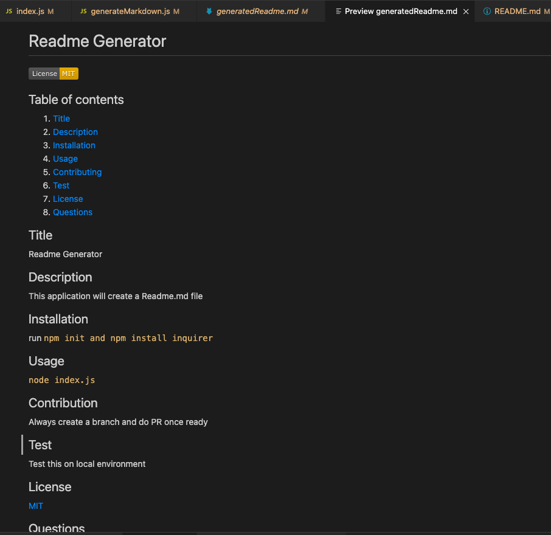

# Readme Generator

### Description:
```
When creating an open source project on GitHub, it’s important to have a high-quality README for the app. This should include what the app is for, how to use the app, how to install it, how to report issues, and how to make contributions—this last part increases the likelihood that other developers will contribute to the success of the project. You can quickly and easily generate a README file by using a command-line application to generate one. This allows the project creator to devote more time working on the project.
```

## Acceptance Criteria
```
GIVEN a command-line application that accepts user input
WHEN I am prompted for information about my application repository
THEN a high-quality, professional README.md is generated with the title of my project and sections entitled Description, Table of Contents, Installation, Usage, License, Contributing, Tests, and Questions
WHEN I enter my project title
THEN this is displayed as the title of the README
WHEN I enter a description, installation instructions, usage information, contribution guidelines, and test instructions
THEN this information is added to the sections of the README entitled Description, Installation, Usage, Contributing, and Tests
WHEN I choose a license for my application from a list of options
THEN a badge for that license is added near the top of the README and a notice is added to the section of the README entitled License that explains which license the application is covered under
WHEN I enter my GitHub username
THEN this is added to the section of the README entitled Questions, with a link to my GitHub profile
WHEN I enter my email address
THEN this is added to the section of the README entitled Questions, with instructions on how to reach me with additional questions
WHEN I click on the links in the Table of Contents
THEN I am taken to the corresponding section of the README
```
## User Story
```
AS A developer
I WANT a README generator
SO THAT I can quickly create a professional README for a new project
```


  

  ## Table of contents
  1. [Title](#title)
  2. [Description](#description)
  3. [Installation](#installation)
  4. [Usage](#usage)
  5. [Contributing](#contributing)
  6. [Test](#test)
  7. [License](#license)
  8. [Questions](#questions)

  ## Title
  Readme Generator

  ## Description
  This application will create a Readme.md file

  ## Installation
  run `npm init and npm install inquirer`

  ## Usage
   `node index.js`

  ## Contribution
  Always create a branch and do PR once ready

  ## Test
  Test this on local environment

  ## License
  [MIT](https://gist.github.com/nicolasdao/a7adda51f2f185e8d2700e1573d8a633#mit-license)
  
  ## Questions
  Do not have any question at this time<br />
  Find me on Github [kazichaska](https://github.com/kazichaska)<br />
  Email me with any question: kazi@email.com <br />

## Screenshots of the code



